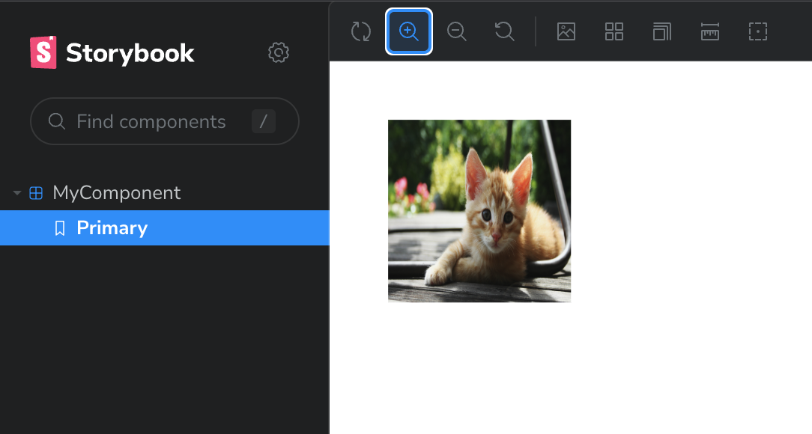

# Storybook + Next.js + Image import

Show that Nx + Next.js + Storybook + Image import works.

## What I did

1. Create Nx workspace with `npx create-nx-workspace@latest`
2. Add Next.js app with `nx g @nx/next:app myapp`
3. Generate component with `nx g @nx/next:component my-component --project=myapp`
4. Add image import in component --> see [my-component.tsx](apps/myapp/components/my-component/my-component.tsx)
5. Generate Storybook configuration with `nx g @nx/react:storybook-configuration myapp`
6. Run Storybook with `nx storybook myapp`

## Result

Storybook loads the image correctly:

